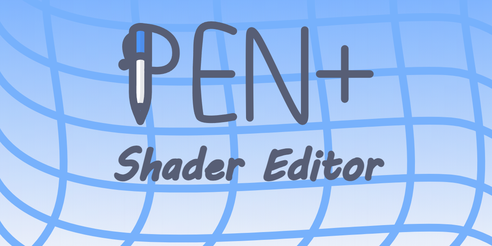
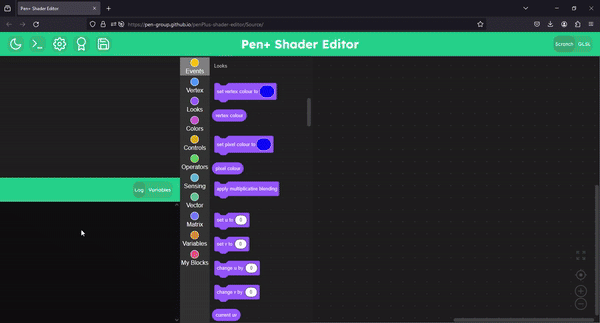
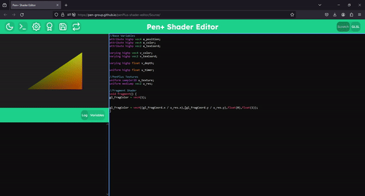
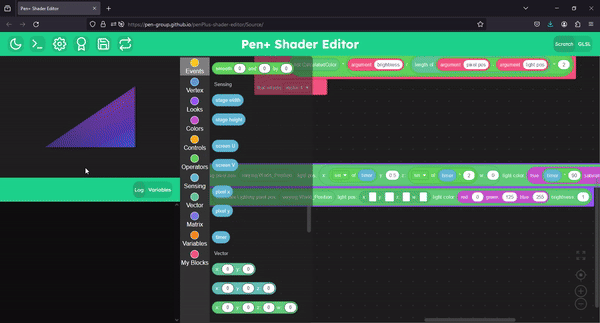
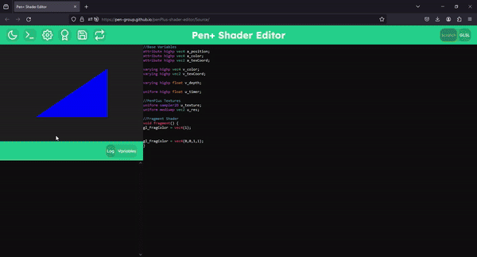

 
 
A Blockly based GLSL editor made for Pen+ Version 7 and Above. 
| BLOCKLY  | GLSL |
| ------------- | ------------- |
|||
|SAVING|LOADING|
|||

## Contributing
When contributing make sure to write a small description of what you have done, 
and also just make sure to use prettier every now and then 

# Building an html file
Before building make sure you have [Node.JS](https://nodejs.org/en) installed. 
To build an html file with windows use 
`build_win.bat` 
To build an html file with linux (*and possibly macintosh?*) use
`build_lin.sh` 
## Where does it appear?
The built file should appear in a Build folder that will contain a file with the UTC timestamp and the Name you put in!
